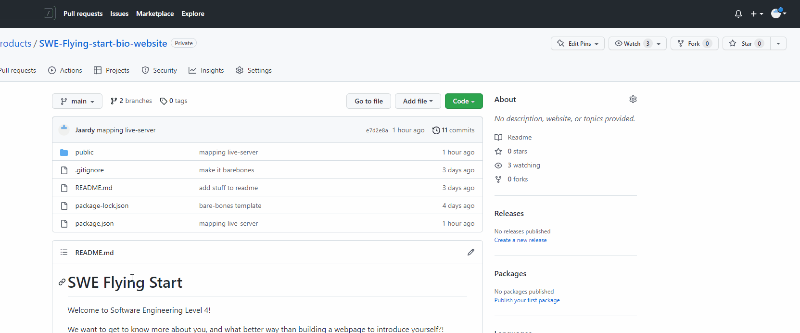
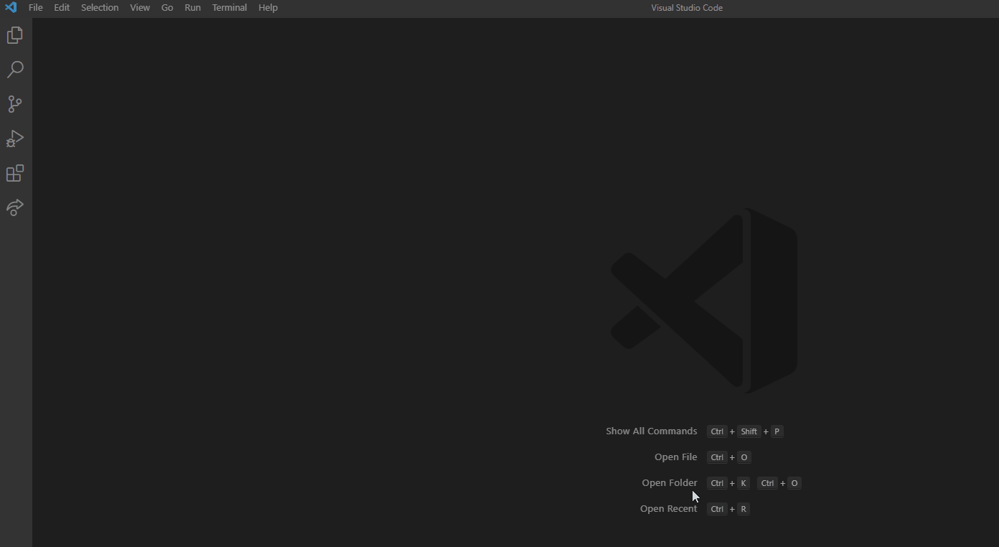

# SWE Flying Start

Welcome to Software Engineering Level 4!

We want to get to know more about you, and what better way than building a webpage to introduce yourself?!

If you need any help with any of the below, that's what we're all here for! You can get help from a fellow apprentice, or any of the coaches. Asking for help at the right time is a very important skill as a developer, so don't be shy.

## Getting set up

We want to get you set up for success. This means getting a few things installed if you haven't already.

 - [VS Code](https://code.visualstudio.com/download) | This is our preferred editor. It integrates with several other technologies we'll be using, and it allows us to jump in and help you with your code remotely using Live Share.
 - [Live Share](https://docs.microsoft.com/en-gb/visualstudio/liveshare/) | As above! Let's get this extension installed. Start up your VS Code and then click *Extensions* from the left menu. Search for Live Share and install the top hit.
 - [Node](https://nodejs.org/en/download/) | When we're building projects in javascript, we'll be using the node runtime. It allows us to run .js files on our computers. When you install Node, you also get npm (node package manager) for free! npm helps us download and use helpful node programs written by other people.
 - [Git](https://git-scm.com/downloads) | Git is what helps us manage different versions of our code. It also helps us share code with others in a safe and structured way. VS Code comes with a built in extension (Source Control) that helps us work with Git.

## Getting started

 1. With the above installed, **make sure you have and are signed in to a GitHub account**. At the top right of this page, click **Fork** to create a fork. Doing this will give you your very own copy of this repo!

 

 1. When you are on the homepage of your fork, copy the url.     

 1. Open VS Code and choose *Clone Git Repository*. Paste in the url to copy the code down to your machine.
 
 

 1. Open a terminal (ctrl + ' will open a terminal screen in vscode), `cd` into your project, and type `npm run start` to start the live server.

 1. Now get hacking! Change the html, css and js as much as you like. Put some content for each section, add a picture and add any new sections as you see fit.

## Share your work

Improve your site as much as you like within the time. You're at the beginning of your journey so we don't expect it to be beautiful or complex. Have fun with the css. Add a bit of interactivity if you know how. Look up css animations if you have time to spare. Anything else you can think of - go for it!

When you're done, commit your code and the push the changes to your fork. Share the url with your coach.
